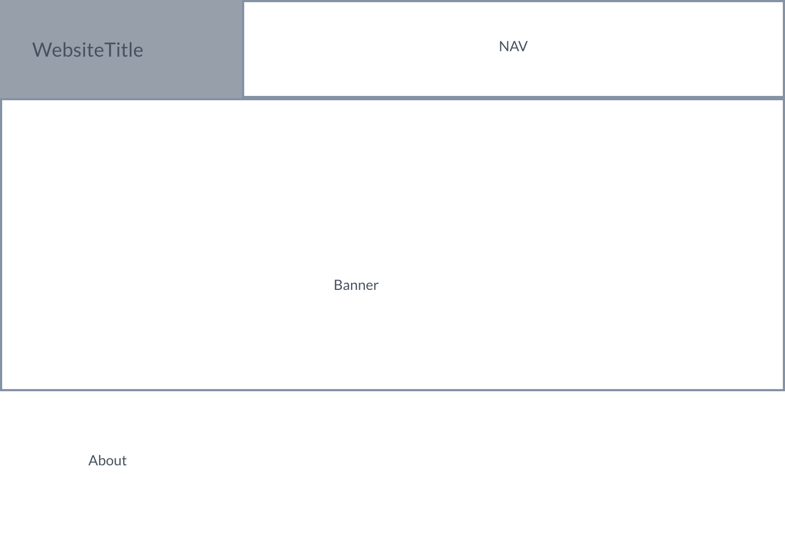
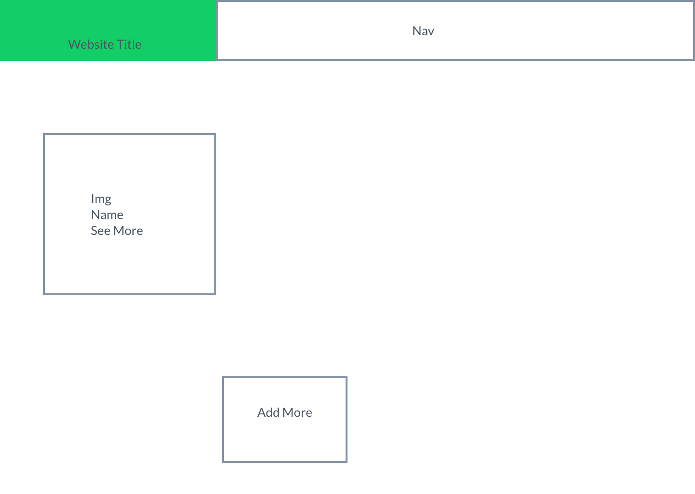
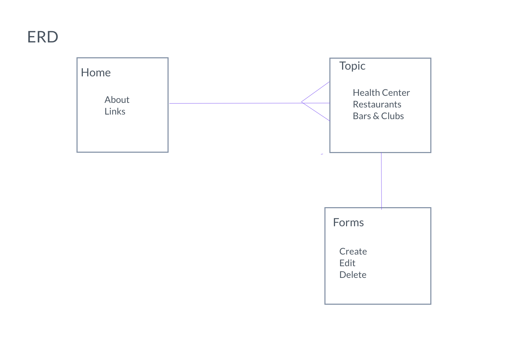
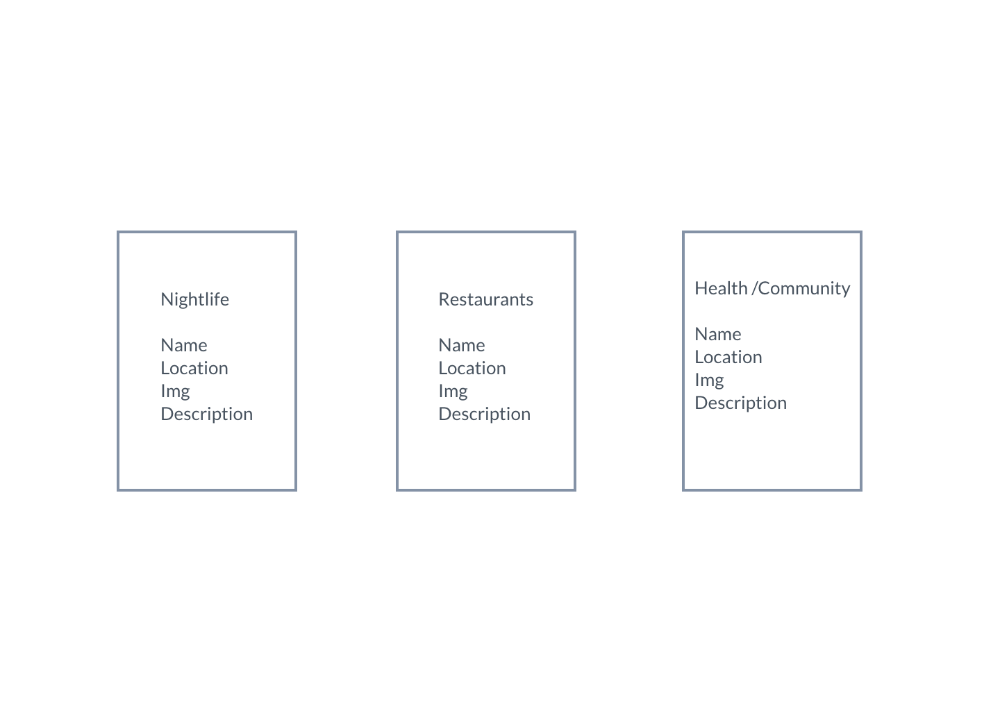
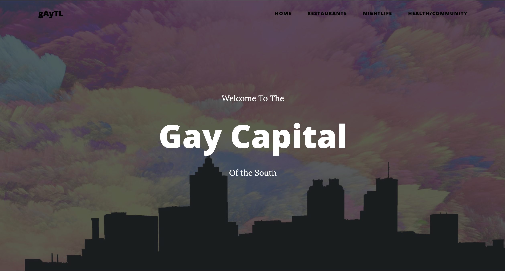
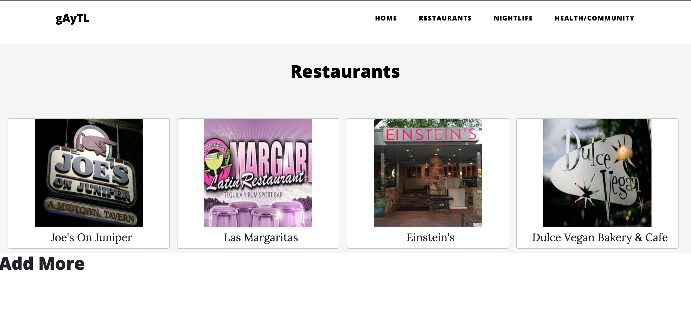
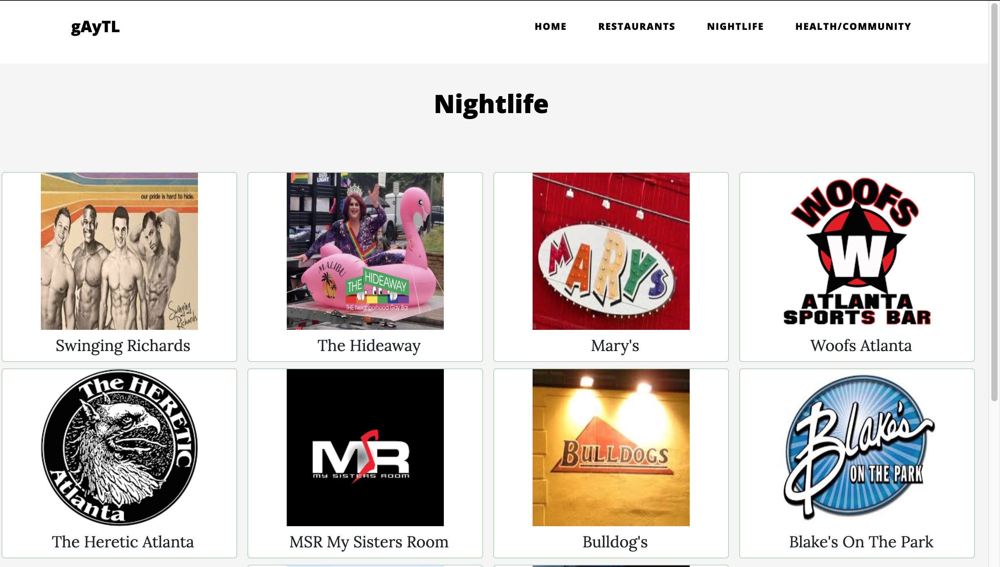
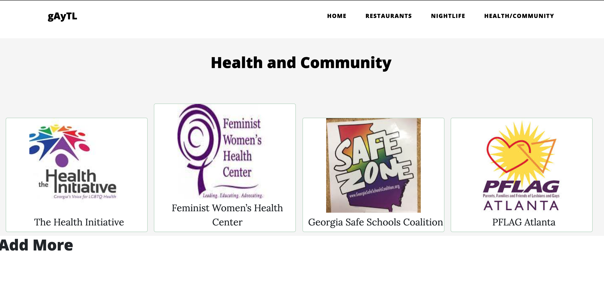

# GayTL

### General Assembly SEI 26- Project 2

* Trello board- https://trello.com/b/qcbIU1fi/gaytl

* Git hub- https://git.generalassemb.ly/bellajco/GayTL

* Link to deployed site- https://fathomless-ravine-38683.herokuapp.com/

## Overview
Create a REST API. For this project I created a database of gay friendly bars, restaurants, and community resources. 

## Technology Used

* Javascript, JQuery, Css. Built with NodeJs and express, Uilitizing Handlebars for the View and MongoDb for the Database

Wireframe:

ERD:

Final Product:

